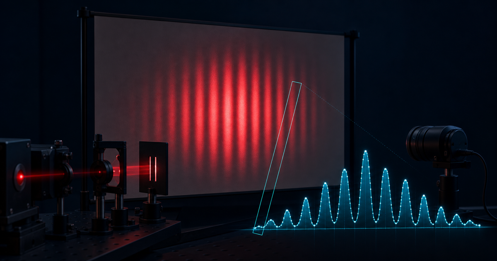

# FringeLab：基于摄像头的激光干涉/衍射分析实验台

FringeLab 将光屏上的单缝衍射或双缝干涉图样转换为一维相对光强曲线，自动识别亮峰、暗纹、条纹间距和宽度，并结合空间标定、缝参数与屏距反演激光波长。

普通摄像头给出的是经镜头、传感器和 ISP 处理后的像素数字量（DN）。因此项目将纵轴严谨标为“相对光强（相机响应，a.u.）”，不会在未经辐射定标时把结果称为照度（lux）或绝对辐照度。



## 已实现功能

- 内置可复现的 650 nm 双缝和 532 nm 单缝物理仿真，无器材也可跑通实验。
- 浏览器摄像头与 PNG/JPEG/WebP 图片输入，摄像头帧默认仅在本地处理。
- 可移动、旋转并通过四角拖动缩放的带状 ROI；支持横向或竖向条纹。
- R/G/B/亮度通道及自动通道选择，背景采集与扣除。
- 高斯平滑、自动周期估计、峰谷检测、亚像素中心、FWHM、饱和平台告警。
- 双缝多级亮纹精确几何回归与单缝多级暗纹回归；同时给出小角近似对照。
- Fresnel 数、采样充分度、标定、曝光与饱和质量门控。
- 一阶不确定度传播与 95% 扩展不确定度。
- CSV、JSON、曲线 PNG 导出，以及浏览器本地实验参数保存。
- 图表显示峰值限制为 98%，保留顶部空间但不裁剪原始或导出数据；理想模型拟合曲线可独立显示或隐藏。
- 摄像头或实验图片可自动寻找实物尺、稳健拟合毫米刻线，并叠加背景自适应的高对比虚拟尺；支持框选回退、刻线磁吸、手动起始刻度和失效状态追踪。

## 本地运行

需要 Node.js `>=22.13.0`。

```bash
npm install
npm run dev
```

然后打开 `http://localhost:3000`。摄像头 API 在 `localhost` 或 HTTPS 安全上下文中可用；不同浏览器/设备对手动曝光、对焦和白平衡的支持不同，界面会按实际能力降级。

## 建议实验流程

1. 先用内置仿真熟悉 ROI、标定、峰谷和导出。
2. 使激光通过已知缝宽 `a` 的单缝，或已知中心距 `d` 的双缝，在漫反射白屏上成像。
3. 摄像头只观察光屏，避免激光直射传感器；降低曝光直到所有亮峰都没有 255 平台。
4. 将标尺与条纹置于同一光屏平面，可用“两点标定”快速得到 `mm/px`。
5. 将 ROI 采样轴调至垂直于条纹，并用 ROI 厚度沿条纹方向平均降噪。
6. 图片/摄像头模式可在光学画面下方展开 `RULER FIT`：先自动识别或框选实物尺，检查刻线残差与透视警告，再人工确认并应用 `mm/px`。OCR 未确认时输入一根长刻线的起始值即可，比例仍由刻线周期决定。
7. 输入 `a`/`d`、缝到屏距离 `L` 及其不确定度，检查全部质量门控。
8. 至少重复三次并导出 CSV/JSON，保留相机设置、原始图像和环境条件。

完整流程见 [测量规程](docs/MEASUREMENT_PROTOCOL.md)，空间和响应标定见 [标定说明](docs/CALIBRATION.md)。

## 物理模型

单缝 Fraunhofer 衍射：

```text
I(θ) = I₀ [sin(β)/β]²,   β = πa sinθ / λ
a sinθₙ = nλ
```

有限缝宽双缝：

```text
I(θ) = I₀ [sin(β)/β]² cos²(πd sinθ / λ)
d sinθₘ = mλ
```

屏面位置默认按 `sinθ = x / sqrt(L² + x²)` 做精确几何转换；小角公式仅作快速对照。模型适用边界、术语、相机测量链和来源见 [科学依据](docs/SCIENTIFIC_BASIS.md)。

## 质量与测试

```bash
npm run lint
npm run typecheck
npm run test:unit
npm test
```

验证设计与验收基准见 [验证计划](docs/VALIDATION.md)。

## 主要技术栈

- TypeScript、React 与 Next.js 风格 App Router 界面。
- HTML Canvas 像素处理与实时曲线绘制。
- 浏览器 MediaDevices 摄像头接口与纯本地帧分析。
- Node.js 内置测试运行器、ESLint 与 TypeScript 类型检查。

## 当前已知限制

- 未经辐射定标时只能比较相对相机响应，不能输出 lux 或 W/m²。
- 手机或摄像头的自动曝光、白平衡、降噪与 gamma 会改变峰高，因此波长计算优先使用条纹位置。
- 峰顶饱和时峰高和 FWHM 不可信，应降低曝光或加入中性密度衰减片。
- 远场公式要求 Fresnel 数足够小；界面给出的门控提示不能替代光路条件检查。
- 摄像头能力取决于浏览器和硬件，部分设备无法锁定曝光或对焦。
- 实物尺数字识别当前是可选锚点，不作为比例来源；数字未确认时需手动填写起始刻度。检测到明显透视会降级并警告，当前版本不声称已完成单应性校正。

## 激光安全

- 不直视光束，不把眼睛置于可能的镜面反射路径。
- 摄像头只拍摄漫反射光屏，不直接对准激光器出光口。
- 优先使用满足教学需求的最低功率等级，并按本地实验室规范配置护目镜和光束终止器。
- 软件告警不能替代实验室风险评估与教师监督。
